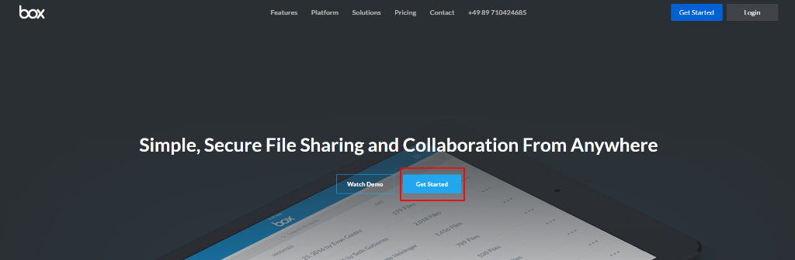
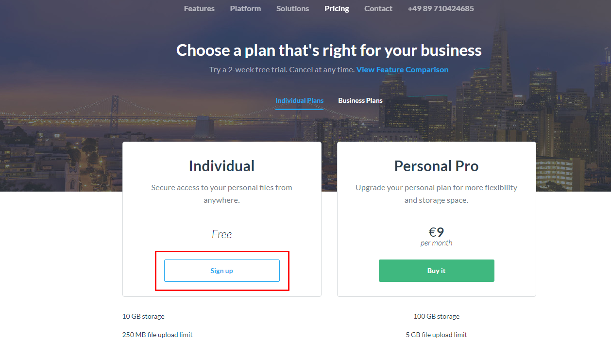
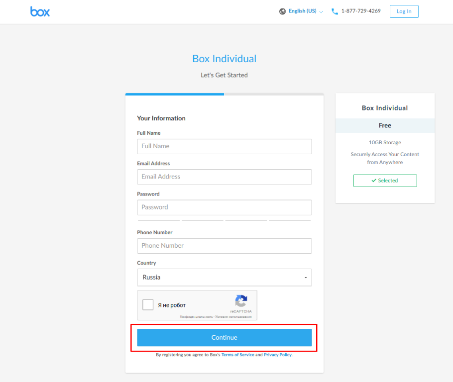

# Box registration

Added April 29, 2018.

1. To create an account, click on the link
 (https://www.box.com/en-gb/home) 
and click on the button “Get Started”.

2. Choose an individual plan and click on the button “Sign Up”.

3. Fill in all the necessary information for registration in the form and click on the button “Continue”.

4. In the next window make the necessary settings and click on the button “Submit”.

5. Confirm registration via e-mail.

!(image006.png)

6. Enter the email in the window that opens after the verification, click on "Next".

7. In the next window enter your password and click on the link "Log in".

8. Choose the purpose of using the BOX service and click on "Next".

9. In the next window you can click on the link “Skip this and go straight to Box”.

10. Account registration was successful.

11. To register the application, follow the link (https://developer.box.com/) 
and click on the button “Get Started”.

12. Click on the button “Log in”.

13. When the window Developer Console opens, click on the button “Create new app”.

14. Select an application type “Partner integration” and click on the button “Next”.

15. Enter the application name. Click on the button “Create app”.

16. Application is created. Go to the application.

17. In the "Configuration" section, get the "Client ID" and "Client Secret" keys, enter “Redirect URL” and Click on the button “Save changes”.

